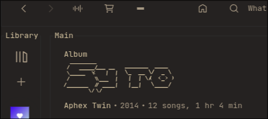
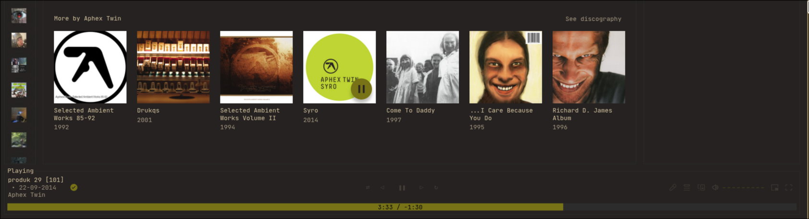
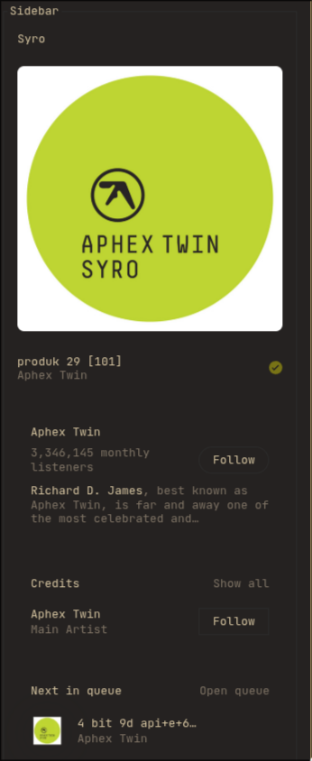

# [Samantha theme] for Spicetify

> A custom Spicetify theme featuring vibrant colors, cleaner interface features like hidden banners, and unique accents.
> It is a custom theme, that probably wont be used by anyone else, so it is highly presonalized (less images, no podcasts...)

Based on the **"text"** theme by [darkthemer](https://github.com/darkthemer).

---

## 📸 Showcase

Here is a look at the theme in action, showing main views and specific details.

### Main Views

**Title Header View:**


**Red Banner Accent:**


### Details & Features

A closer look at specific theme elements:

**Green Bar Accent:**


**Clean "No Artist Image" Placeholder:**


**Podcasts Section (Easter Egg):**


---

## ✨ Features

* **Vibrant Colors:** Enhanced color palette for better contrast and look.
* **Clean UI:** Banners and some distractions are hidden for a cleaner experience.
* **Custom details:** Unique touches on headers, bars, and placeholders.

## ⚙️ Installation

1. Copy the theme folder to your Spicetify themes directory:
   ```bash
   cp -r spicetify-theme/Themes/text/ ~/.config/spicetify/Themes/
2. Apply the theme:
```bash
spicetify config current_theme text
spicetify apply
